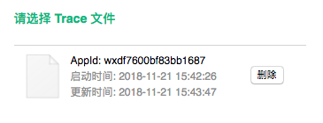
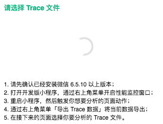

# 小程序应用反编译与性能追踪

Note:
砍价滚起来越来越卡，开发预览不动了

---

<!-- .slide: data-background="./images/wx-copy.png" -->

## 反编译 - unpack

Note:
小程序要被复制了怎么办？
https://developers.weixin.qq.com/community/develop/doc/00020a3cc5c1e83410b736e4856000

--

### 模拟器 - 免 root

```bash
adb shell
cd /data/data/com.tencent.mm/MicroMsg
root@x86:/data/data/com.tencent.mm/MicroMsg # find . -name "*.wxapkg"
$ ./d83052b721488288ac84a87bf0c20913/appbrand/pkg/_1123949441_171.wxapkg
$ ./d83052b721488288ac84a87bf0c20913/appbrand/pkg/_677503696_10.wxapkg
```

--

### adb 常用命令

```bash
adb start-server: 启动adb进程
adb kill-server: 杀死adb进程
adb devices: 查看当前与开发环境连接的设备，此命令也可以启动adb进程
adb install XXX.apk: 往模拟器安装apk
adb uninstall 包名: 删除模拟器中的应用
adb shell: 进入linux命令行
adb pull <remote> <local>：把安卓设备文件复制到本地
```

--

### 拷贝到本地

```bash
adb pull /data/data/com.tencent.mm/MicroMsg/d83052b721488288ac84a87bf0c20913/appbrand/pkg ~/Desktop/wxapkgs
```

--

### 执行

肩膀 - [wxappUnpacker](https://github.com/qwerty472124/wxappUnpacker)

```bash
node wuWxapkg.js <wxapkg package path>
```

---

## 性能 - performance trace

--

### 小程序 trace panel

- **开发版**菜单 -> 性能监控面板
- 指标
  - CPU, 内存，页面切换耗时
  - 启动耗时
- 体验版、正式版也显示 `性能数据`

--

### 开发工具 trace panel

- 选择完设备
- 小程序导出文件
- 分析



--

### Confusing

- 
- [Trance Panel 缺少小程序页面信息](https://developers.weixin.qq.com/community/develop/doc/00002cbf13c810556287ba7e85f400?highLine=trace)

<!--  -->

--

### mpvue lint

- lint
- trace

```js
const mpTrace = require('@waimai/mpvue-lint/mpvue-trace')
mpTrace.trace(Vue) // Vue是当前页面中的Vue实例
```

[https://github.com/mpvue/mpvue-lint](https://github.com/mpvue/mpvue-lint)

---

## 安卓投影

- vysor
- apowerMirror


---

## 参考

- [反编译微信小程序](http://www.cnblogs.com/zeroes/p/unpack-wechat-app.html)
- [小程序-性能](https://developers.weixin.qq.com/miniprogram/dev/framework/performance/)
- [小程序性能测试](https://zhuanlan.zhihu.com/p/42213056)
- [ADB Hints](https://devhints.io/adb)
- [从源码看微信小程序启动过程](https://juejin.im/post/5af95a3d6fb9a07ac363979c)
- [小程序包目录结构](https://mp.weixin.qq.com/s/O3Ix91GkkS0ollYK_s6e_Q)
- [优化建议](https://juejin.im/post/5b496d5d5188251a90187635)
- [小程序自动化测试](https://juejin.im/entry/587441178d6d8100589f0446)

---

谢谢

## SPA WXApp

- 一个页面一个Vue实例 (更改mpv-loader支持单个实例)
- 定制 navigation bar
